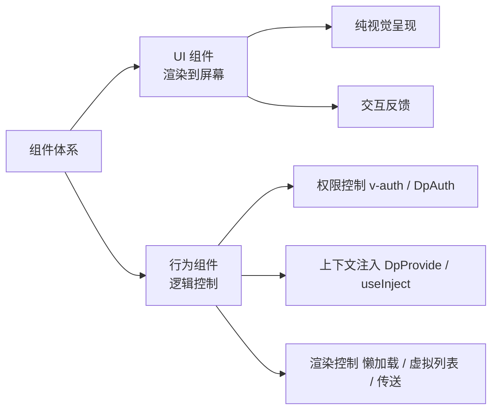
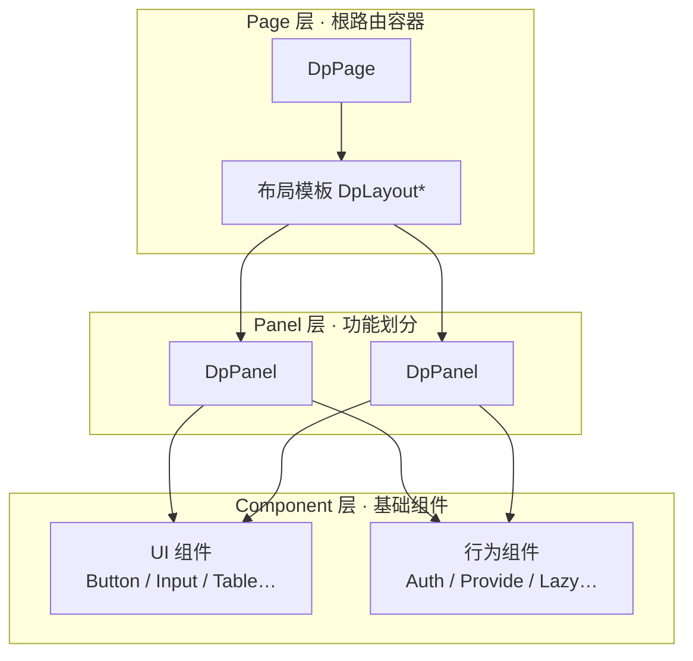
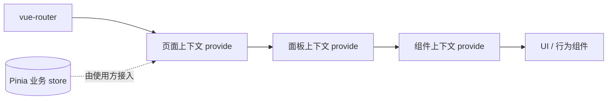
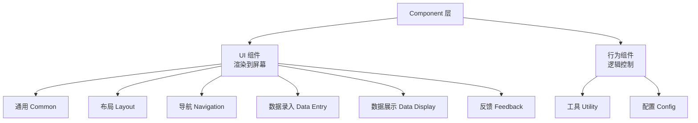

# @dp_ui/core 组件库设计文档

| 项目   | 内容                                             |
| ------ | ------------------------------------------------ |
| 版本   | v0.1（草案）                                     |
| 日期   | 2026-07-31                                       |
| 状态   | 待评审                                           |
| 技术栈 | Vue 3.5 · TypeScript · reka-ui · UnoCSS · Vite 8 |

---

## 1. 概述

### 1.1 背景与目标

`@dp_ui/core` 是一个基于最新前端技术栈、面向业务界面搭建的 Vue 组件库。它定位为 **页面级组件库**：不仅提供可复用的基础组件，还提供「页面（page）→ 面板（panel）→ 组件（component）」的三层界面组织范式，让使用者以「搭积木」的方式快速搭建完整业务界面。

目标：

1. 基于 `reka-ui`（无样式原语）+ `UnoCSS`（原子化样式）构建，**不引入其他第三方组件库，也不使用任何 CSS 预处理器**。
2. 对外同时支持 **全量加载** 与 **按需加载** 两种引入方式，并保证 tree-shaking 友好。
3. 以「UI 组件 / 行为组件」二元划分组织基础组件，UI 组件负责视觉与交互呈现，行为组件负责逻辑控制（权限、上下文注入等）。
4. 建立 page → panel → component 三层结构：路由集中到 page，功能划分落到 panel，基础能力收敛到 component。

### 1.2 需求要点（用户原意拆解）

- 技术基础：`reka-ui` + `unocss`；不得引入其他第三方组件库，不得使用 CSS 预处理器（sass/less/postcss 等）。
- 提供「按需加载」与「全量加载」两种对外使用方式。
- 组件须支持外部通过 **CSS（类 / CSS 变量）** 或 **属性（props）传值** 便捷地修改样式，具备可定制性（详见 §8.4）。
- 组件整体分为两类：
  - **UI 组件**：实际渲染在屏幕上的组件。
  - **行为组件**：逻辑控制类，如权限控制、组件上下文注入等（多表现为不渲染 DOM 或渲染透明包装）。
- 界面结构为 **page → panel → component** 三层：
  - **page**：根路由容器，负责界面整体结构布局，处理所有路由相关事务。
  - **panel**：page 的组成部分，page 由多个 panel 组成，负责页面功能划分；panel **不涉及路由显示**。
  - **component**：基础组件（即 UI / 行为组件）。

### 1.3 非目标（本期不做）

- 不实现 SSR / Nuxt 适配（保留扩展空间，组件保持渲染器无关）。
- 不做移动端优先设计（响应式能力由 UnoCSS 断点体系保证，不单独做 H5 组件）。
- 不内置状态管理方案（页面/面板状态由使用方在 Pinia 中管理，库只提供上下文注入机制）。

---

## 2. 技术选型与约束

| 类别               | 选型                                  | 版本基线 | 用途                                                 |
| ------------------ | ------------------------------------- | -------- | ---------------------------------------------------- |
| 框架               | Vue                                   | ^3.5     | `<script setup>` + Composition API                   |
| 语言               | TypeScript                            | ~7.0     | 全量类型推导，`vue-tsc` 校验                         |
| 底层原语           | reka-ui                               | ^2.10    | 无样式组件原语（Dialog/Select/Tooltip…）与组合式函数 |
| 样式               | UnoCSS                                | ^66      | 原子化 CSS + 设计令牌（preset），替代 CSS 预处理器   |
| 构建               | Vite（库模式）                        | ^8       | 多入口打包，产出 ESM/CJS 与按需子路径产物            |
| 路由（使用方范式） | vue-router                            | ^5       | page 作为路由组件，路由配置集中在 page               |
| 测试               | Vitest + @vue/test-utils / Playwright | —        | 单元测试 / E2E                                       |
| 代码质量           | oxlint + oxfmt                        | —        | lint / format                                        |

**硬性约束**：

- 除 `reka-ui` 与 `unocss` 外，**不得引入其他第三方组件库**。
- **不使用 CSS 预处理器**：样式一律通过 UnoCSS（原子类、`@apply` 指令、设计令牌）表达，由 UnoCSS 编译期生成 CSS。
- 构建链路中使用 Vite 官方能力及 UnoCss 官方插件即可，不额外引入按需加载插件（按需能力由产物结构与 tree-shaking 天然保证，见 §7）。

---

## 3. 核心架构

### 3.1 组件的二维划分

所有组件按「是否直接渲染视觉内容」划分为两类，这是整个组件体系的第一层分类：



- **UI 组件**：有可见 DOM 输出、有视觉与交互语义。例：`DpButton`、`DpInput`、`DpModal`、`DpTable`。
- **行为组件**：通常渲染为透明的 `<template>`/`<slot>` 包装或完全不渲染 DOM，只负责提供逻辑能力。例：`DpAuth`、`DpProvide`、`DpPortal`、`DpLazy`；指令形式的 `v-auth` 也归属行为体系。

### 3.2 三层结构：page → panel → component

在 UI 组件/行为组件之上，还存在 **页面组织层级**：



### 3.3 层级 × 分类矩阵

| 层级      | 载体                | 是否 UI 组件        | 是否行为组件     | 职责                                                   |
| --------- | ------------------- | ------------------- | ---------------- | ------------------------------------------------------ |
| Page      | `DpPage` + 布局模板 | 容器型（含布局 UI） | 注入页面级上下文 | 根路由容器；决定界面整体结构布局；**处理全部路由事务** |
| Panel     | `DpPanel`           | 容器型              | 注入面板级上下文 | 页面的功能划分单元；不感知、不显示路由                 |
| Component | `DpButton` 等       | 纯 UI               | —                | 可复用的基础视觉/交互能力                              |
| Component | `DpAuth` 等         | —                   | 纯逻辑           | 可复用的逻辑能力                                       |

> 说明：page / panel 属于「容器组件」，实现上通常同时具备 UI 与行为两面性——它们向外表现为 UI 容器，向内通过 context 注入承担行为组件职责。基础 component 则严格二分为 UI 与行为。

### 3.4 数据/上下文流转



---

## 4. 分层详细设计

### 4.1 Page 层（页面容器）

**定义**：page 是根路由的容器，一个路由对应一个 page；page 决定整个界面的结构布局，并集中处理所有路由相关事务。

**组件**：

- `DpPage`：作为 vue-router 的 `routes[].component` 使用。
  - props：`layout?: string | Component`（选择布局模板）、`title?: string`（文档标题/面包屑来源）等；也支持从 `route.meta` 读取配置。
  - 职责：读取路由元信息 → 解析布局模板 → 渲染布局骨架 → 通过 `<slot>`/`<router-view>` 放置由 panel 组成的内容区。
- 布局模板 `DpLayoutBasic` / `DpLayoutSider` / `DpLayoutFull`：定义 header / sider / main / footer 的区域划分与占位，是「界面结构布局」的实现层。

**路由职责（全部收敛在 page）**：

- 路由表定义、动态路由注册、路由守卫（权限、登录态）由 page 层或使用方在 page 路由配置中处理。
- `usePage()` composable 提供页面级上下文（当前路由信息、布局配置、页面级权限结果、页面状态注入）。

**关键约束**：panel 与 component **不感知路由**，不产生路由显示。

### 4.2 Panel 层（功能面板）

**定义**：panel 是 page 的组成部分，负责页面的功能划分；page 由多个 panel 组成，panel 不涉及路由的显示。

**组件**：`DpPanel`

- props：`title`、`collapsible`、`default-collapsed`、`size`、`loading`、`bordered` 等通用面板能力。
- 职责：
  - 将页面内容划分为逻辑独立的功能区块（如「筛选区」「列表区」「详情区」）。
  - 提供面板级上下文（`provide`），子组件通过 `usePanel()` 获取（面板标识、面板级状态、事件总线）。
  - 面板间协作通过页面级上下文或使用方 store 完成，不依赖路由。

### 4.3 Component 层（基础组件）

基础组件严格二分为 UI 组件与行为组件，见 §6。

---

## 5. 路由与页面设计

### 5.1 设计原则

- 路由表在 page 层定义与维护；panel 不产生任何路由显示，不感知 `$route`。
- `DpPage` 是唯一的路由组件形态。路由配置示例（使用方视角）：

```ts
// 使用方 app 的路由表（仅示意，非库内实现）
{
  path: '/dashboard',
  name: 'dashboard',
  component: DpPage,
  meta: { layout: 'sider', title: '工作台', auth: 'dashboard:view' },
}
```

- 页面布局通过 `DpPage` 的 `layout` 属性或 `route.meta.layout` 解析，由布局模板渲染整体结构。

### 5.2 页面组成示例（使用方视角，仅示意）

```vue
<template>
  <!-- 由 DpPage + 布局模板承载，页面内容由多个 DpPanel 组成 -->
  <DpPanel title="筛选区"> ... </DpPanel>
  <DpPanel title="数据列表" collapsible> ... </DpPanel>
  <DpPanel title="详情" size="wide"> ... </DpPanel>
</template>
```

---

## 6. 组件体系设计

### 6.1 分类总览（参考 Naive UI）

参考 Naive UI 官方「组件」页面的分类法，@dp_ui/core 将基础组件组织为 **8 类**（去掉 Naive UI 的「废弃组件」类），并映射到「UI 组件 / 行为组件」二元体系——其中「工具 Utility」「配置 Config」两类在 @dp_ui/core 中天然属于行为组件：

| Naive UI 分类         | @dp_ui/core 归属 | 定位                                         |
| --------------------- | ---------------- | -------------------------------------------- |
| 通用 Common           | UI 组件          | 基础视觉原子                                 |
| 布局 Layout           | UI 组件          | 布局容器与间距                               |
| 导航 Navigation       | UI 组件          | 页面/内容导航                                |
| 数据录入 Data Entry   | UI 组件          | 表单输入                                     |
| 数据展示 Data Display | UI 组件          | 数据呈现                                     |
| 反馈 Feedback         | UI 组件          | 交互反馈                                     |
| 工具 Utility          | 行为组件         | 滚动 / 虚拟列表 / 过渡 / 独立 API 等逻辑封装 |
| 配置 Config           | 行为组件         | 全局配置 / 上下文注入 / 权限等               |



### 6.2 UI 组件清单（六类，基于 reka-ui 原语封装）

所有 UI 组件在 reka-ui 之上做「样式化 + 行为约定」封装，视觉层全部用 UnoCSS 表达；reka-ui 未提供的原语（Table / Tree 等）由 @dp_ui/core 基于 Vue + 原子类自研。

**通用组件（Common）**

| @dp_ui/core 组件 | 说明     | 对应 reka-ui 原语            |
| ---------------- | -------- | ---------------------------- |
| `DpButton`       | 按钮     | Primitive / Button           |
| `DpIcon`         | 图标     | —（基于 UnoCSS presetIcons） |
| `DpTypography`   | 排版     | —（自研）                    |
| `DpTag`          | 标签     | —（自研）                    |
| `DpDivider`      | 分割线   | Separator                    |
| `DpAvatar`       | 头像     | Avatar                       |
| `DpCard`         | 卡片     | —（自研，基于 CSS）          |
| `DpCollapse`     | 折叠面板 | Collapsible                  |
| `DpDropdown`     | 下拉菜单 | DropdownMenu                 |
| `DpEllipsis`     | 文本省略 | —（自研）                    |
| `DpCarousel`     | 轮播图   | —（自研）                    |
| `DpPageHeader`   | 页头     | —（自研）                    |
| `DpWatermark`    | 水印     | —（自研）                    |
| `DpFloatButton`  | 浮动按钮 | —（自研）                    |

**布局组件（Layout）**

| @dp_ui/core 组件 | 说明     | 对应 reka-ui 原语                 |
| ---------------- | -------- | --------------------------------- |
| `DpLayout`       | 布局     | —（自研，与 Page 层布局模板配合） |
| `DpGrid`         | 栅格     | —（自研，CSS Grid）               |
| `DpSpace`        | 间距     | —（自研）                         |
| `DpFlex`         | 弹性布局 | —（自研）                         |
| `DpSplit`        | 面板分割 | —（自研）                         |

**导航组件（Navigation）**

| @dp_ui/core 组件 | 说明            | 对应 reka-ui 原语        |
| ---------------- | --------------- | ------------------------ |
| `DpMenu`         | 菜单            | Menubar / NavigationMenu |
| `DpTabs`         | 标签页          | Tabs                     |
| `DpPagination`   | 分页            | Pagination               |
| `DpBreadcrumb`   | 面包屑          | —（自研）                |
| `DpSteps`        | 步骤条          | —（自研）                |
| `DpAnchor`       | 锚点 / 侧边导航 | —（自研）                |
| `DpAffix`        | 固钉            | —（自研）                |
| `DpBackTop`      | 回到顶部        | —（自研）                |

**数据录入组件（Data Entry）**

| @dp_ui/core 组件     | 说明     | 对应 reka-ui 原语           |
| -------------------- | -------- | --------------------------- |
| `DpForm` / `DpField` | 表单     | Form                        |
| `DpInput`            | 文本输入 | —（自研，基于原生 + Field） |
| `DpInputNumber`      | 数字输入 | —（自研）                   |
| `DpSelect`           | 选择器   | Select                      |
| `DpCheckbox`         | 复选框   | Checkbox                    |
| `DpRadio`            | 单选框   | RadioGroup                  |
| `DpSwitch`           | 开关     | Switch                      |
| `DpSlider`           | 滑动选择 | Slider                      |
| `DpDatePicker`       | 日期选择 | DatePicker                  |
| `DpTimePicker`       | 时间选择 | DatePicker                  |
| `DpCascader`         | 级联选择 | Combobox / 自研             |
| `DpAutoComplete`     | 自动补全 | Combobox                    |
| `DpMention`          | 提及     | —（自研）                   |
| `DpRate`             | 评分     | —（自研）                   |
| `DpColorPicker`      | 颜色选择 | —（自研）                   |
| `DpUpload`           | 上传     | —（自研）                   |
| `DpTransfer`         | 穿梭框   | —（自研）                   |
| `DpDynamicInput`     | 动态录入 | —（自研）                   |
| `DpDynamicTags`      | 动态标签 | —（自研）                   |

**数据展示组件（Data Display）**

| @dp_ui/core 组件    | 说明     | 对应 reka-ui 原语 |
| ------------------- | -------- | ----------------- |
| `DpTable`           | 表格     | —（自研）         |
| `DpTree`            | 树       | —（自研）         |
| `DpList`            | 列表     | —（自研）         |
| `DpDescriptions`    | 描述     | —（自研）         |
| `DpStatistic`       | 统计数值 | —（自研）         |
| `DpEmpty`           | 空状态   | —（自研）         |
| `DpImage`           | 图像     | —（自研）         |
| `DpTimeline`        | 时间线   | —（自研）         |
| `DpCalendar`        | 日历     | Calendar          |
| `DpCountdown`       | 倒计时   | —（自研）         |
| `DpNumberAnimation` | 数值动画 | —（自研）         |
| `DpHighlight`       | 高亮文本 | —（自研）         |
| `DpInfiniteScroll`  | 无限滚动 | —（自研）         |

**反馈组件（Feedback）**

| @dp_ui/core 组件 | 说明           | 对应 reka-ui 原语 |
| ---------------- | -------------- | ----------------- |
| `DpModal`        | 模态框         | Dialog            |
| `DpDrawer`       | 抽屉           | Dialog            |
| `DpMessage`      | 信息（函数式） | Toast + 自研      |
| `DpNotification` | 通知           | Toast             |
| `DpAlert`        | 警告信息       | —（自研）         |
| `DpBadge`        | 徽标           | —（自研）         |
| `DpLoadingBar`   | 加载条         | —（自研）         |
| `DpTooltip`      | 文字提示       | Tooltip           |
| `DpPopover`      | 弹出信息       | Popover           |
| `DpPopconfirm`   | 弹出确认       | Popover + 自研    |
| `DpPopselect`    | 弹出选择       | Popover + Select  |
| `DpProgress`     | 进度           | Progress          |
| `DpSpin`         | 加载           | —（自研）         |
| `DpSkeleton`     | 骨架屏         | —（自研）         |
| `DpResult`       | 结果页         | —（自研）         |

### 6.3 行为组件清单（工具 / 配置，参考 Naive UI）

行为组件对应 Naive UI 的「工具 Utility」「配置 Config」两类，另含 @dp_ui/core 面向业务的扩展（权限、上下文注入）：

**工具类（Utility）— 渲染 / 逻辑控制**

| @dp_ui/core            | 说明                         | 对应 Naive UI       |
| ---------------------- | ---------------------------- | ------------------- |
| `DpVirtualList`        | 虚拟列表                     | Virtual List        |
| `DpScrollbar`          | 滚动条                       | Scrollbar           |
| `DpCollapseTransition` | 折叠过渡                     | Collapse Transition |
| `DpDiscreteApi`        | 独立 API（命令式调用）       | Discrete API        |
| `DpLazy`               | 延迟渲染（@dp_ui/core 扩展） | —                   |
| `DpPortal`             | 传送（@dp_ui/core 扩展）     | —                   |

**配置类（Config）— 上下文注入**

| @dp_ui/core                     | 说明                                     | 对应 Naive UI   |
| ------------------------------- | ---------------------------------------- | --------------- |
| `DpConfigProvider`              | 全局配置（主题 / 语言 / 权限注入）       | Config Provider |
| `DpGlobalStyle`                 | 全局样式注入                             | Global Style    |
| `DpElement`                     | 元素渲染注入                             | Element         |
| `DpAuth` / `v-auth` / `useAuth` | 权限控制（@dp_ui/core 扩展）             | —               |
| `DpProvide` / `useInject`       | 显式作用域上下文注入（@dp_ui/core 扩展） | —               |

**指令形态**：`v-auth`、`v-loading`、`v-tooltip` 等指令归入对应的行为能力。

### 6.4 组件通用约定

- **命名**：统一 `Dp` 前缀，`Dp + PascalCase`；目录 `kebab-case`。
- **props / emits / slots**：每个组件遵循「受控优先」原则；提供 `default` 插槽优先。
- **install 挂载**：每个组件通过 `withInstall()` 包裹，导出组件本身 + `install` 方法，以支持全量 `app.use(DpUi)`。
- **类型导出**：`DpXxxProps`、`DpXxxEmits`、`DpXxxInstance` 等类型随组件导出。
- **样式**：组件模板内使用 UnoCSS 原子类；复杂/重复样式用 `@apply` 提取到 `styles/` 或组件内 `<style>` 的 `@apply` 块。
- **样式可定制**：组件暴露语义化样式 props（`size` / `type` / `variant` / `color` 等）；`class` / `style` 通过 attrs 透传到根元素；设计令牌输出为 `--dp-*` CSS 变量，外部可通过 **props 传值** 或 **CSS** 便捷覆盖（详见 §8.4）。

---

## 7. 打包、发布与引入方式

### 7.1 构建产物

使用 Vite **库模式 + 多入口**构建，`build/build.lib.ts` 自动收集入口：

- 主入口 `src/index.ts` → 全量包（含 `install` 与全部具名导出）。
- 每个组件入口（`components/<分类>/<组件>/index.ts`、`page`、`panel`）→ 独立子路径产物。
- 样式产物 `dist/style.css`：由 UnoCSS 扫描组件源码生成。
- 类型产物 `dist/*.d.ts`。

产物结构示意：

```
dist/
├── core.mjs / core.cjs           # 全量入口（ESM / CJS）
├── core.d.ts
├── style.css                     # 全量样式
├── preset-core.mjs / .d.ts       # 设计令牌 preset（供使用方 UnoCSS 接入）
├── components/
│   ├── button/
│   │   ├── index.mjs             # 按需子路径
│   │   └── index.d.ts
│   └── ...
└── page/ panel/ ...              # 容器层级子路径
```

### 7.2 全量加载

```ts
import { createApp } from "vue";
import DpUi from "@dp_ui/core";
import "@dp_ui/core/style.css";

createApp(App).use(DpUi).mount("#app");
```

- 注册全部组件与指令；适合不需要极致包体、追求零配置的接入场景。

### 7.3 按需加载

方案一（推荐，零额外依赖，纯 tree-shaking）：

```ts
// 具名导入，依赖 ESM tree-shaking，未使用的组件不进包
import { DpButton, DpPanel } from "@dp_ui/core";
```

方案二（子路径精确导入）：

```ts
import DpButton from "@dp_ui/core/components/button";
```

方案三（可选增强，不违反"不引入组件库"约束，因为它属于构建工具而非组件库）：

> 可选用 `unplugin-vue-components` + 库内置 resolver 实现模板内自动按需导入。本期默认不依赖，列为可选优化项。

### 7.4 `package.json` 关键字段设计

```jsonc
{
  "name": "@dp_ui/core",
  "version": "0.1.0",
  "type": "module",
  "main": "./dist/core.cjs",
  "module": "./dist/core.mjs",
  "types": "./dist/core.d.ts",
  "exports": {
    ".": {
      "types": "./dist/core.d.ts",
      "import": "./dist/core.mjs",
      "require": "./dist/core.cjs",
    },
    "./style.css": "./dist/style.css",
    "./unocss": { "types": "./dist/preset-core.d.ts", "import": "./dist/preset-core.mjs" },
    "./components/*": "./dist/components/*/index.mjs",
    "./package.json": "./package.json",
  },
  "sideEffects": ["./dist/style.css", "**/*.css"],
  "files": ["dist"],
  "peerDependencies": {
    "vue": "^3.5.0",
    "reka-ui": "^2.0.0",
    "unocss": "^66.0.0",
  },
}
```

- `sideEffects` 只标记 CSS 为副作用，保证 JS 部分可被 tree-shaking。
- `peerDependencies` 声明 vue / reka-ui / unocss，避免重复打包。

---

## 8. 样式与主题（UnoCSS）

### 8.1 样式方案

- 样式全部由 UnoCSS 表达：原子类（模板内）+ `@apply`（组件内样式块）+ 设计令牌（preset 主题）。
- 不使用 Sass/Less/PostCSS 等预处理器；UnoCSS 的 `transformerDirectives()` 已提供 `@apply` / `@screen` 指令能力（工程已启用）。
- 现有 `uno.config.ts` 预设（`presetMini` / `presetTagify` / `presetAttributify` / `presetLegacyCompat` / `presetIcons`）保留，作为库开发环境的基础。

### 8.2 样式交付策略（二选一，推荐 A 为主）

- **策略 A（推荐）**：库构建时由 UnoCSS 扫描组件源码生成 `dist/style.css`，随包发布。
  - 全量接入：`import '@dp_ui/core/style.css'` 一次性引入，**使用方零 UnoCSS 配置**即可工作。
  - 按需接入：使用方项目自身启用 UnoCSS，并引入库的 `presetDpUi` 预设；UnoCSS 会按使用到的组件精确生成所需样式（更小产物、可定制主题）。
- **策略 B**：库内不产出样式文件，强制要求使用方项目启用 UnoCSS + `presetDpUi`。包体最小但接入成本高，作为可选项。

### 8.3 设计令牌与主题定制

- `src/tokens/` 定义设计令牌：颜色（语义色/中性色）、间距、圆角、字体、阴影、断点、层级 z-index 等。
- 封装为 **`presetDpUi`**（一个 UnoCSS preset），供使用方在 `uno.config.ts` 中继承：

```ts
// 使用方 uno.config.ts（示意）
import { presetDpUi } from "@dp_ui/core/unocss";
import { defineConfig } from "unocss";
export default defineConfig({ presets: [presetDpUi()] });
```

- 主题定制通过覆盖令牌实现（`presetDpUi({ ...覆盖项 })`），无需改动组件源码。

### 8.4 组件级样式可定制（对外使用）

**需求**：外部使用 component 时，应能通过 **CSS** 或 **属性（props）传值** 两种途径便捷地修改组件样式，无需改动组件源码、无需依赖全局主题。

**途径一：通过属性（props）传值**

- 每个组件提供语义化样式 props：
  - 通用外观：`size`（sm / md / lg）、`type` / `variant`（primary / success / warning / danger / info…）、`color`、`round`、`bordered`、`loading`、`disabled` 等。
  - 组件特有：如 `DpInput` 的 `clearable`、`DpModal` 的 `width` 等。
- 统一约定：`class` 与 `style` 通过 **attrs 透传**到组件根元素（`inheritAttrs: false` 时显式绑定到根节点），外部可直接传类名或内联样式。
- 预留 `cssVars` 类 props（可选）：允许外部按需传入键值对，写入根元素上的 `--dp-*` CSS 变量。

```vue
<!-- 使用方示例（仅示意） -->
<DpButton size="lg" type="primary" round class="my-btn" style="--dp-radius: 12px">
  提交
</DpButton>
```

**途径二：通过 CSS 修改**

- **CSS 变量（推荐）**：所有设计令牌在组件根元素以 `--dp-*` CSS 变量输出（如 `--dp-color-primary`、`--dp-radius-lg`、`--dp-size-btn-h`），遵循 CSS 变量继承，外部在任意父级或组件根上覆盖即可生效：

```css
/* 使用方全局覆盖（仅示意） */
:root {
  --dp-color-primary: #6366f1;
}
.my-scope .dp-button {
  --dp-radius: 8px; /* 局部覆盖 */
}
```

- **类名覆盖**：组件根元素挂载稳定语义类名（`dp-button` 等）与 BEM 子元素类名（`dp-button__icon` / `dp-button__label`），外部可用 CSS 选择器精确覆盖；透传的 `class` 优先级高于默认类。
- **主题级覆盖**：`DpConfigProvider` 提供 `themeOverrides` 属性（组件级令牌覆盖表），可按组件名覆盖其令牌集合，配合 `presetDpUi` 实现全局/局部主题切换。

**覆盖优先级（由低到高）**

| 层级                                                         | 说明                  |
| ------------------------------------------------------------ | --------------------- |
| 设计令牌默认值                                               | 组件内部默认令牌      |
| 全局主题（`presetDpUi` / `DpConfigProvider.themeOverrides`） | 全局或按组件覆盖      |
| 外部 CSS 类（`class` 透传 / 父级 CSS 变量覆盖）              | 选择器 / 变量继承覆盖 |
| 内联 `style` 与 props 显式传值                               | 单次使用最优先        |

> 说明：因「不使用 CSS 预处理器」，以上覆盖全部基于原生 CSS 变量 + 类名 + props 实现，天然支持外部覆盖，并与 UnoCSS 原子类（`class` 透传）完全兼容。

---

## 9. 文件结构

```
dp_ui/                                   # pnpm workspace 根
├── package.json                         # workspace 根（pnpm --filter 脚本）
├── pnpm-workspace.yaml                  # packages: ['packages/*']
├── README.md
├── docs/
│   └── DESIGN.md                        # 本文档
├── services/                            # （已有，非本库内容）
└── packages/
    ├── core/                            # @dp_ui/core 组件库包
    │   ├── package.json
    │   ├── uno.config.ts                # 库构建时 UnoCSS 配置
    │   ├── vite.config.ts               # 库开发/测试基础配置（vitest 合并）
    │   ├── vitest.config.ts
    │   ├── tsconfig.json / tsconfig.app.json / tsconfig.node.json / tsconfig.vitest.json / tsconfig.build.json
    │   ├── build/
    │   │   ├── build.lib.ts             # 库模式构建：多入口收集 + 产物生成
    │   │   └── collect-entries.ts       # 自动收集组件/子路径入口
    │   ├── src/
    │   │   ├── index.ts                 # 主入口：全量 install + 具名导出
    │   │   ├── page/                    # ── Page 层 ──
    │   │   │   ├── DpPage.vue           # 页面容器（路由组件）
    │   │   │   ├── layouts/             # 界面结构布局模板
    │   │   │   │   ├── DpLayoutBasic.vue
    │   │   │   │   ├── DpLayoutSider.vue
    │   │   │   │   ├── DpLayoutFull.vue
    │   │   │   │   └── index.ts
    │   │   │   ├── pageContext.ts       # 页面级 provide/inject
    │   │   │   ├── usePage.ts           # 页面级 composable
    │   │   │   └── index.ts
    │   │   ├── panel/                   # ── Panel 层 ──
    │   │   │   ├── DpPanel.vue          # 功能面板容器
    │   │   │   ├── panelContext.ts
    │   │   │   ├── usePanel.ts
    │   │   │   └── index.ts
    │   │   ├── components/              # ── Component 层（按功能分类，不再分 ui/behavior）──
    │   │   │   ├── common/              # 通用：button/icon/tag/divider/avatar/card…
    │   │   │   │   └── button/
    │   │   │   │       ├── DpButton.vue
    │   │   │   │       ├── index.ts     # 导出组件 + install
    │   │   │   │       └── __tests__/DpButton.spec.ts
    │   │   │   ├── layout/              # 布局：space/grid/flex…
    │   │   │   ├── navigation/          # 导航：tabs/pagination/breadcrumb/steps…
    │   │   │   ├── data-entry/          # 数据录入：input/select/checkbox/radio/switch…
    │   │   │   ├── data-display/        # 数据展示：table/empty…
    │   │   │   ├── feedback/            # 反馈：modal/tooltip/alert/spin…
    │   │   │   ├── auth/                # 权限（业务扩展）：DpAuth.vue + useAuth.ts
    │   │   │   ├── provide/             # 上下文注入（业务扩展）：DpProvide / useInject
    │   │   │   ├── lazy/                # 延迟渲染：DpLazy
    │   │   │   └── config/              # 配置注入：DpConfigProvider / useTheme
    │   │   ├── directives/              # 指令形态（v-auth / v-loading…）
    │   │   │   ├── auth.ts
    │   │   │   └── index.ts
    │   │   ├── composables/             # 共享组合式函数
    │   │   │   ├── useTheme.ts
    │   │   │   ├── useBreakpoint.ts
    │   │   │   ├── useLocale.ts
    │   │   │   └── index.ts
    │   │   ├── tokens/                  # 设计令牌 & UnoCSS preset
    │   │   │   ├── presetDpUi.ts        # 导出给使用方的 preset
    │   │   │   ├── colors.ts / spacing.ts / radius.ts / typography.ts / z-index.ts
    │   │   │   └── index.ts
    │   │   ├── styles/
    │   │   │   └── index.css            # 基础 reset / 全局样式
    │   │   ├── types/
    │   │   │   ├── page.ts / panel.ts / component.ts
    │   │   │   └── index.ts
    │   │   └── utils/
    │   │       ├── withInstall.ts       # 组件 install 挂载辅助
    │   │       ├── event.ts / dom.ts
    │   │       └── index.ts
    │   └── docs/                        # 组件文档
    │       ├── guide/                   # 快速开始 / 全量与按需 / 主题定制
    │       └── components/              # 各组件文档
    └── playground/                      # 演示应用包（依赖 @dp_ui/core: workspace:*）
        ├── package.json
        ├── index.html
        ├── vite.config.ts               # dev 直接指向库源码（@dp_ui/core 别名）
        ├── uno.config.ts                # 引入 presetDpUi
        ├── playwright.config.ts         # E2E webServer
        ├── src/
        │   ├── main.ts                  # 全量加载：app.use(DpUi)
        │   ├── App.vue
        │   ├── router/index.ts          # 路由集中在 page 层
        │   ├── pages/                   # 演示用 page（HomePage 全量 / OnDemandPage 按需）
        │   └── components/PageInfo.vue  # usePage 演示
        └── e2e/                         # Playwright E2E
            └── vue.spec.ts
```

> 说明：每个组件目录内聚「组件、导出、单元测试」，逻辑较多的组件另加 `useXxx.ts`；行为组件同理。这样既支持按需子路径构建，也便于维护。

---

## 10. 命名与开发规范

- 组件：`Dp` + PascalCase；文件 `DpXxx.vue`；目录 `kebab-case`。
- 指令：`v-` 前缀，`v-auth` 等；`directives/` 下同名文件。
- composables：`useXxx`。
- 类型：`DpXxxProps` / `DpXxxEmits` / `DpXxxSlots` / `DpXxxInstance`。
- 令牌：语义命名（`primary` / `success` / `warning` / `danger` / `info`，中性色 `neutral-*`）。
- 提交前：`pnpm lint`（oxlint）+ `pnpm fmt`（oxfmt）；lint-staged 已配置。

---

## 11. 测试

- **单元（Vitest）**：每个组件 `__tests__/` 覆盖渲染、props/emits、交互、行为组件逻辑（权限判断、上下文注入、懒加载触发）。
- **E2E（Playwright）**：`e2e/` 覆盖 page→panel→component 组织范式下的真实交互链路。
- **接入验证**：`packages/playground/` 分别以全量、按需两种方式接入，确保产物与 tree-shaking 正确。

---

## 12. 文档与演示

- `docs/guide/`：快速开始、全量/按需接入、主题定制、page/panel 范式。
- `docs/components/`：每个组件的 props / emits / slots / 示例。
- `packages/playground/`：可运行的演示页面（含一个多 panel 的业务页面样例）。

---

## 13. 里程碑

| 阶段 | 内容     | 产出                                                                                                   |
| ---- | -------- | ------------------------------------------------------------------------------------------------------ |
| M1   | 工程骨架 | 目录落地、构建脚本、主入口与 `withInstall`、基础 tokens/preset、packages/playground 接入验证           |
| M2   | 三层结构 | `DpPage` + 布局模板 + `DpPanel` + 上下文；示例页面                                                     |
| M3   | 核心组件 | 常用 UI 组件（Button/Input/Select/Modal/Tooltip 等）+ 行为组件（Auth/Provide/Lazy）；按需/全量产物验证 |
| M4   | 打磨     | 主题定制、文档、测试补齐、发布配置（exports/sideEffects/files）                                        |

---

## 14. 待确认问题（开放项）

1. 按需加载是否接受「具名导入 + tree-shaking」作为默认形态？是否需要 `unplugin-vue-components` 的自动导入（属构建工具，不违反约束）？
2. 样式交付采用策略 A（默认，带 `dist/style.css`）还是 A+B 并存？
3. `DpPage` 的布局信息通过 `route.meta` 还是组件 prop 注入？建议 `meta` 优先、prop 兜底。
4. 组件前缀固定为 `Dp`，是否需支持自定义前缀（可通过 preset/全局配置调整）？
5. 是否需要 npm 私服发布计划与版本策略（语义化版本）？

---

_本设计文档为草案，评审通过后按 M1→M4 落地实现。_
